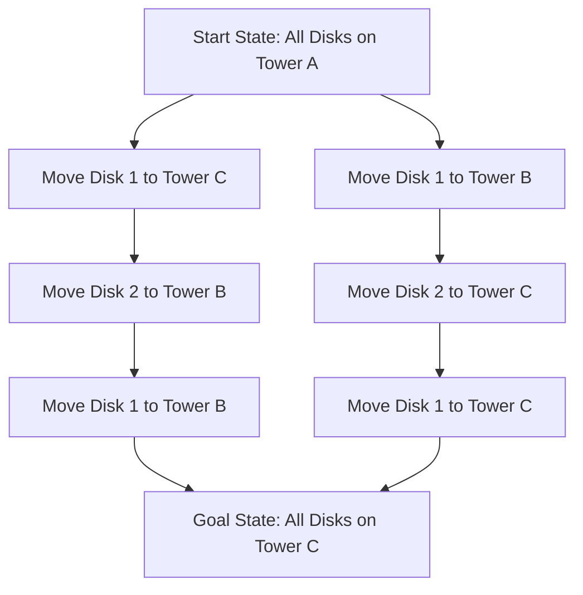

# Tower of Hanoi Game

An interactive visualization of the classic **Tower of Hanoi** problem, illustrating fundamental concepts from **Artificial Intelligence and algorithm design**. The puzzle can be modeled as a **state-space search problem**, where each configuration of disks represents a state and each legal disk movement represents a transition between states.

The project highlights how complex problems can be solved through **recursive decomposition and optimal planning**, leading to the theoretical minimum number of moves required to reach the goal state (2ⁿ - 1). By interacting with the game, users can observe how constraints guide the search process and how optimal solutions emerge from structured problem-solving strategies.

This project demonstrates core computational ideas such as:

* Recursive problem solving
* State-space representation
* Constraint-based decision making
* Optimal solution generation

## AI Perspective: State-Space Representation

In the context of **Artificial Intelligence**, the Tower of Hanoi can be modeled as a **state-space search problem**.

* **State**: A configuration of disks across the three towers
* **Action**: Moving the top disk from one tower to another valid tower
* **Goal State**: All disks moved to the destination tower following the constraints

The search process explores transitions between valid states until the goal configuration is reached. The optimal solution requires **2ⁿ − 1 moves**, illustrating recursive decomposition and optimal planning.

### Simplified State-Space Diagram

This diagram illustrates how the puzzle can be viewed as a **graph traversal problem**, where each node represents a state and edges represent valid moves between states.

## Live Demo

Play the game here:
https://tower-of-hanoi-kohl.vercel.app
  

